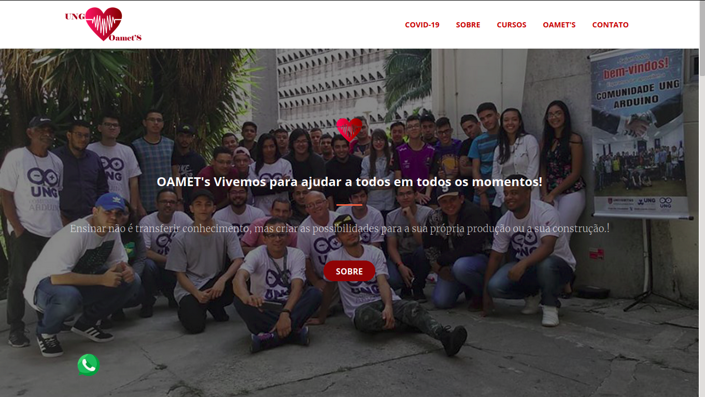
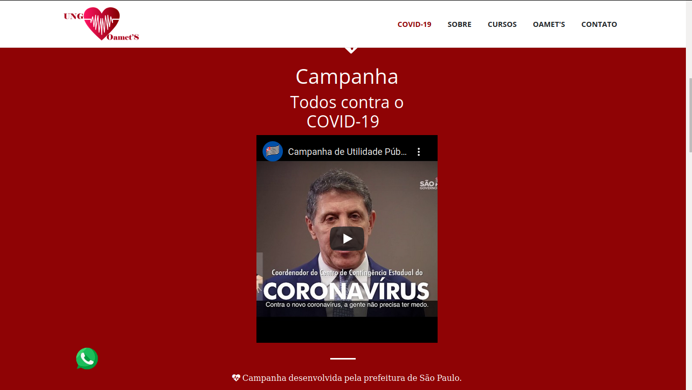
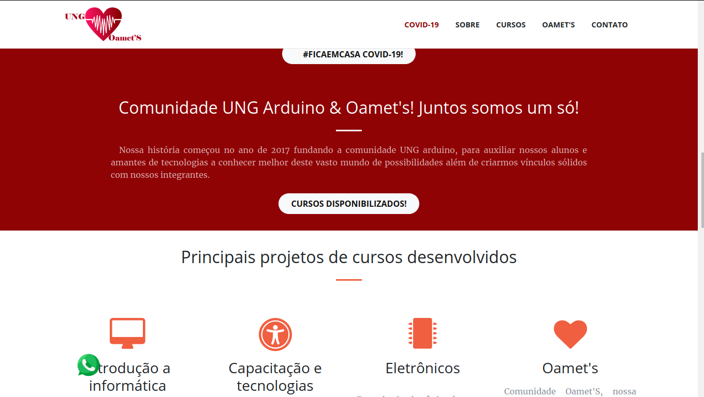
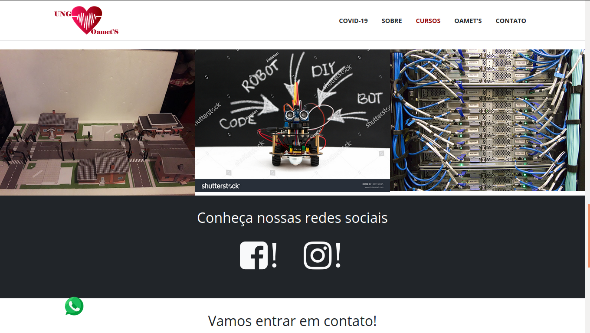
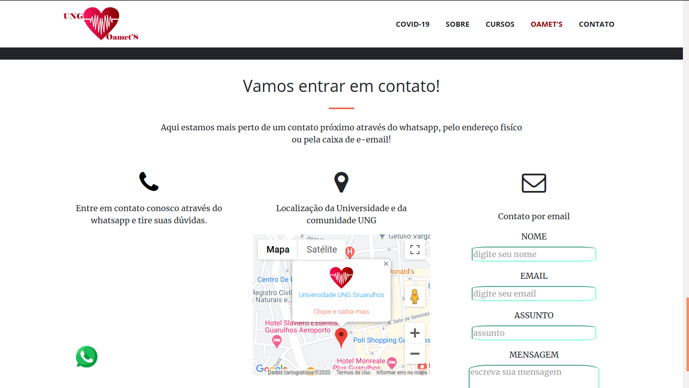

### Hi there 👋

  
 <h2 align="center">GitHub Readme Stats</h2>

 
GitHub statistics generated dynamically in my readmes!

  

    
    
    
     
  

  

    <h2>
      !!Web Site Profile!!!
    </h2>
    <a align="center" href="https://dev-portifolio.vercel.app">🌱 My Profile</a>
    
 Project developed by students of the informatics course.
      From the beginning, the idea of ​​the project was only for the purpose of academic work, which ended up becoming a student profile project.
    

    

      Visit, the website or send an email or message through github 
    

  

### 🔭 I’m currently working on Projects personal in React - React-Native - Node.Js - Html - Css - JS

### Project in developer

  <h1>Project "UNG Arduino Oamet's"</h1>
  <h1 align="center" styled="text-decoration: none"> <a href="https://comunidade-ung-arduino.vercel.app/">UNG Arduino Oamet's</a>
  </h1>
  
 Project created in 2017 by developers, alumni, makers and by loveing tecnologic.  

  
 Adress:  R. Eng. Prestes Maia, 88 - Centro, Guarulhos - SP, 07023-070 

  <ul>
    <li> </li>
    <li></li>
    <li> </li>
    <li> </li>
    <li> </li>
  </ul>
  

<!--
**JoaoPauloMP0105/JoaoPauloMP0105** is a ✨ _special_ ✨ repository because its `README.md` (this file) appears on your GitHub profile.

Here are some ideas to get you started:

- 🌱 I’m currently learning ...
- 👯 I’m looking to collaborate on ...
- 🤔 I’m looking for help with ...
- 💬 Ask me about ...
- 📫 How to reach me: ...
- 😄 Pronouns: ...
- ⚡ Fun fact: ...
-->